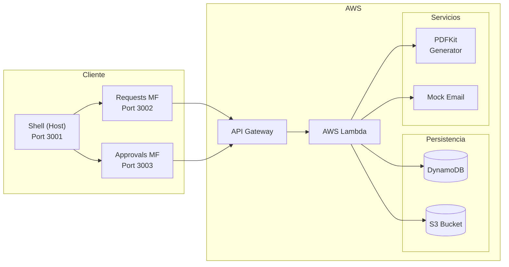

# Purchase Approval System

Sistema de flujo de aprobación de solicitudes de compra con firma digital concatenada.

## Descripción

El sistema resuelve el problema de gestionar el ciclo de vida completo de aprobación de compras empresariales. Un solicitante crea una solicitud que debe ser aprobada por 3 aprobadores con roles específicos (Gerente, Finanzas, Legal). Cada aprobador recibe un link único con token, valida su identidad mediante OTP, y procede a firmar digitalmente (aprobar o rechazar). Cuando los 3 aprobadores firman, se genera automáticamente un PDF de evidencia con todas las firmas concatenadas.

### Flujo completo

1. Solicitante crea solicitud con 3 aprobadores
2. Sistema inicializa 3 registros de aprobación con tokens UUID
3. Sistema envía notificaciones simuladas con links de aprobación
4. Cada aprobador abre su link y genera un OTP (3 minutos de vigencia)
5. Aprueba o rechaza registrando nombre y fecha de firma
6. Al completarse las 3 firmas, se genera PDF de evidencia
7. Solicitud cambia a COMPLETED y el PDF está disponible para descarga

## Arquitectura



### Arquitectura Backend (Domain Driven Design)

```
backend/src/
├── adapters/               # Capa de entrada (HTTP)
│   ├── controllers/        # Controladores con validación
│   ├── handlers/           # Lambda handlers (API Gateway V2)
│   └── middlewares/        # Error middleware (middy)
├── application/            # Casos de uso y servicios
│   ├── dto/               # DTOs y schemas Zod
│   ├── ports/             # Interfaces de repositorio
│   ├── services/          # Servicios de aplicación
│   └── use-cases/         # Casos de uso orquestados
├── domain/                # Núcleo del dominio
│   ├── entities/          # Entidades puras
│   └── errors/            # Errores de dominio
└── infrastructure/        # Implementaciones concretas
    ├── config/            # Variables de entorno
    ├── database/          # Cliente DynamoDB
    ├── notifications/     # MockEmailRepository
    ├── repositories/      # DynamoDB repositories
    └── storage/           # S3 / Mock storage
```

### Microfrontends Frontend

```
frontend/
├── shell/                 # Host (Webpack Module Federation)
│   ├── Port 3001
│   └── Orquestación de microfrontends
├── requests-mf/           # Microfrontend Solicitudes
│   ├── Port 3002
│   └── Crear, listar, detalle de solicitudes
└── approvals-mf/          # Microfrontend Aprobaciones
    ├── Port 3003
    └── Flujo OTP + firma digital
```

## Tecnologías utilizadas

### Backend

| Tecnología | Versión | Uso |
|---|---|---|
| Node.js | >= 20 | Runtime |
| TypeScript | 5.7 | Lenguaje |
| Serverless Framework | 3.x | IaC y despliegue AWS |
| AWS Lambda | Node.js 20 | Cómputo serverless |
| DynamoDB | - | Base de datos NoSQL |
| S3 | - | Almacenamiento PDF |
| API Gateway V2 | HTTP API | Exposición REST |
| pdfkit | 0.19 | Generación PDF |
| Zod | 4.4 | Validación de schemas |
| middy | 5.3 | Middleware Lambda |
| esbuild | 0.24 | Bundling |

### Frontend

| Tecnología | Uso |
|---|---|
| React 18 | UI Framework |
| TypeScript | Lenguaje |
| Webpack 5 + Module Federation | Microfrontends |
| Tailwind CSS 3 | Estilos |
| React Router DOM 6 | Navegación |
| Axios | HTTP Client |
| Jest + Testing Library | Tests |

## Endpoints API

### Solicitudes

| Método | Path | Descripción |
|---|---|---|
| POST | `/purchase-requests` | Crear solicitud de compra |
| GET | `/purchase-requests` | Listar solicitudes |
| GET | `/purchase-requests/{id}` | Obtener detalle |
| PATCH | `/purchase-requests/{id}/status` | Actualizar estado |

### Aprobaciones

| Método | Path | Descripción |
|---|---|---|
| POST | `/purchase-requests/{id}/approvals` | Crear aprobación |
| GET | `/purchase-requests/{id}/approvals` | Listar aprobaciones |
| PATCH | `/approvals/{id}` | Firmar (approve/reject) |

### OTP

| Método | Path | Descripción |
|---|---|---|
| GET | `/approvals/{token}/otp` | Generar OTP |
| POST | `/approvals/{token}/validate-otp` | Validar OTP |

### Otros

| Método | Path | Descripción |
|---|---|---|
| GET | `/mock-mail` | Ver correos simulados |
| GET | `/api/solicitudes/{id}/evidencia.pdf` | Descargar PDF |
| GET | `/health` | Health check |

### Documentación Swagger

La especificación OpenAPI 3.0 completa está disponible en:

```
docs/swagger.yaml
```

## Instalación

### Requisitos

- Node.js >= 20
- pnpm
- Java Runtime (para DynamoDB Local)

### Backend

```bash
cd backend
pnpm install
pnpm dev
```

Esto inicia:
- API REST en `http://localhost:3000`
- DynamoDB Local en `http://localhost:8000`

### Frontend

```bash
cd frontend
pnpm install
pnpm dev
```

Esto inicia:
- Shell (Host) en `http://localhost:3001`
- Requests MF en `http://localhost:3002`
- Approvals MF en `http://localhost:3003`

### Flujo de prueba local completo

```bash
# 1. Crear solicitud de compra
curl -X POST http://localhost:3000/purchase-requests \
  -H "Content-Type: application/json" \
  -d '{
    "title": "Compra laptops",
    "description": "Equipos para desarrollo",
    "amount": 5000000,
    "requesterId": "solicitante@empresa.com",
    "approvers": [
      {"name": "Carlos Perez", "email": "carlos@empresa.com", "role": "MANAGER"},
      {"name": "Maria Gomez", "email": "maria@empresa.com", "role": "FINANCE"},
      {"name": "Luis Rojas", "email": "luis@empresa.com", "role": "LEGAL"}
    ]
  }'

# 2. Ver correos simulados (obtener tokens)
curl http://localhost:3000/mock-mail

# 3. Generar OTP para un aprobador
curl http://localhost:3000/approvals/{token}/otp

# 4. Validar OTP
curl -X POST http://localhost:3000/approvals/{token}/validate-otp \
  -H "Content-Type: application/json" \
  -d '{"otpCode": "123456"}'

# 5. Aprobar solicitud
curl -X PATCH http://localhost:3000/approvals/{id} \
  -H "Content-Type: application/json" \
  -d '{"status": "APPROVED", "signedBy": "Carlos Perez"}'

# 6. Descargar PDF (cuando las 3 firmas estén completas)
curl http://localhost:3000/api/solicitudes/{id}/evidencia.pdf \
  -o evidencia.pdf
```

## Variables de entorno

Crear archivos `.env` a partir de `.env.example`:

```bash
cp .env.example backend/.env
cp frontend/shell/.env.example frontend/shell/.env
```

### Backend

| Variable | Default | Descripción |
|---|---|---|
| `AWS_REGION` | `us-east-1` | Región AWS |
| `PURCHASE_REQUESTS_TABLE` | `PurchaseRequests-dev` | Tabla DynamoDB de solicitudes |
| `APPROVALS_TABLE` | `Approvals-dev` | Tabla DynamoDB de aprobaciones |
| `S3_BUCKET_NAME` | `purchase-evidence-bucket-dev` | Bucket S3 para PDFs |
| `NODE_ENV` | `dev` | Ambiente (dev/test usa mock storage) |

### Frontend

| Variable | Default | Descripción |
|---|---|---|
| `API_BASE_URL` | `http://localhost:3000` | URL base de la API |

## Modelo de datos

### DynamoDB: PurchaseRequests

| Atributo | Tipo | Descripción |
|---|---|---|
| id (PK) | String (UUID) | Identificador único |
| title | String | Título de la solicitud |
| description | String | Descripción |
| amount | Number | Monto |
| requesterId | String | Email del solicitante |
| approvers | Array | 3 aprobadores (name, email, role) |
| status | String | PENDING / SIGNED / REJECTED / COMPLETED |
| createdAt | String (ISO) | Fecha de creación |
| evidenceUrl | String (opcional) | URL del PDF generado |

### DynamoDB: Approvals

| Atributo | Tipo | Descripción |
|---|---|---|
| id (PK) | String (UUID) | Identificador único |
| purchaseRequestId (GSI PK) | String (UUID) | ID de la solicitud |
| approverId | String | Email del aprobador |
| approvalToken (GSI PK) | String (UUID) | Token para link de aprobación |
| status | String | PENDING / APPROVED / REJECTED |
| otpCode | String (opcional) | Código OTP generado |
| otpExpiresAt | String (opcional) | Expiración del OTP |
| createdAt | String (ISO) | Fecha de creación |
| updatedAt | String (ISO) | Fecha de actualización |
| signedAt | String (opcional) | Fecha de firma |
| signedBy | String (opcional) | Nombre del firmante |

## Supuestos del sistema

- El envío de correos es simulado mediante almacenamiento interno en archivo JSON; no se integra con proveedor real.
- La firma digital es una representación funcional: se registra nombre del firmante y timestamp; no se usa criptografía asimétrica.
- OTP se genera internamente con 6 dígitos y expira a los 3 minutos; no se envía por SMS/email real.
- No se integra proveedor externo de identidad; la validación se basa únicamente en OTP.
- DynamoDB maneja persistencia con claves UUID; no hay consistencia transaccional entre tablas.
- El PDF generado con pdfkit representa evidencia funcional del flujo; no es un documento legalmente vinculante.
- Los ambientes locales usan Serverless Offline con DynamoDB Local.
- Las credenciales AWS reales no están incluidas en el repositorio.
- Cada solicitud requiere exactamente 3 aprobadores con roles únicos (MANAGER, FINANCE, LEGAL).
- El link de aprobación usa el token como único mecanismo de acceso (seguridad por token).

## Decisiones técnicas

### Arquitectura Hexagonal (Ports & Adapters)

- **Dominio puro**: Las entidades `PurchaseRequest` y `Approval` no dependen de infraestructura. Contienen solo lógica de negocio con validaciones de estado y reglas de dominio.
- **Puertos**: Interfaces `PurchaseRequestRepository`, `ApprovalRepository`, `NotificationRepository`, `StorageRepository` definen contratos desacoplados.
- **Adaptadores**: DynamoDB, mock email, y S3/mock storage implementan los puertos. Intercambiables sin afectar lógica de negocio.

### Microfrontends con Module Federation

- **Shell**: Host que orquesta la navegación y carga los microfrontends remotos.
- **Requests MF**: Independiente, gestiona creación y listado de solicitudes.
- **Approvals MF**: Independiente, gestiona el flujo de OTP y firma digital.
- Beneficio: equipos pueden desplegar microfrontends de forma independiente.

### Serverless con DynamoDB

- **Escalabilidad**: DynamoDB escala automáticamente sin gestión de servidores.
- **GSI**: ApprovalTokenIndex permite búsqueda eficiente por token. PurchaseRequestIndex permite listar aprobaciones por solicitud.
- **Pay-per-request**: Ideal para cargas de trabajo variables.

### Separación en capas

| Capa | Responsabilidad |
|---|---|
| **Handlers** | Punto de entrada Lambda, parseo de evento API Gateway |
| **Controllers** | Validación de input (Zod) y coordinación |
| **Use Cases** | Orquestación de lógica de aplicación |
| **Services** | Lógica reutilizable (OTP, notificaciones) |
| **Entities** | Reglas de dominio y transiciones de estado |
| **Repositories** | Persistencia DynamoDB |
| **Storage** | Almacenamiento de PDFs |

### Flujo de firma concatenada

1. `CreatePurchaseRequestUseCase` crea la solicitud + 3 approvals con tokens
2. `ApprovalNotificationService` envía emails con links únicos
3. `GenerateApprovalOtpUseCase` genera OTP por token
4. `ValidateApprovalOtpUseCase` valida contra el código almacenado
5. `UpdateApprovalStatusUseCase` actualiza estado y gatilla evaluación
6. `EvaluatePurchaseRequestApprovalUseCase` verifica si todas las aprobaciones están completas
7. `GenerateEvidencePdfUseCase` genera PDF con pdfkit y lo sube a S3

## Pruebas

### Backend

```bash
cd backend
pnpm test          # Ejecutar tests unitarios
pnpm test:coverage # Con cobertura (mínimo 60%)
pnpm lint          # ESLint
```

**Framework**: Jest + ts-jest

**Cobertura actual**: Línea base 60% (branches, functions, lines, statements)

**Casos probados**:

| Capa | Casos |
|---|---|
| Domain | Transiciones de estado PurchaseRequest (PENDING->COMPLETED, PENDING->REJECTED, SIGNED->COMPLETED, inválidas) |
| Domain | Transiciones Approval, validación OTP |
| Services | Generación OTP (6 dígitos, expiración 3 min) |
| Use Cases | Creación solicitud, evaluación aprobaciones, OTP, validación OTP, actualización estado |
| Handlers | Health check |

### Frontend

```bash
cd frontend
pnpm test
```

**Casos probados** (requests-mf): RequestCard, RequestForm, RequestDetailPage, RequestsListPage
**Casos probados** (approvals-mf): ApprovalActions, ApprovalDetail, OtpForm, StatusBadge

## Despliegue AWS

### Requisitos previos

- AWS CLI configurado con credenciales
- Node.js >= 20
- pnpm

### Pasos

```bash
cd backend

# Desplegar en dev
serverless deploy

# Desplegar en producción
serverless deploy --stage prod

# Desplegar función específica
serverless deploy function --function createPurchaseRequest
```

### Recursos creados automáticamente

| Recurso | Descripción |
|---|---|
| Lambda Functions (12) | Cada endpoint mapeado a una función |
| API Gateway HTTP API | Endpoints REST expuestos |
| DynamoDB PurchaseRequests | Tabla de solicitudes |
| DynamoDB Approvals | Tabla de aprobaciones con GSIs |
| S3 Bucket | Almacenamiento de PDFs |
| IAM Roles | Permisos mínimos necesarios |

### Eliminar recursos

```bash
serverless remove
```
